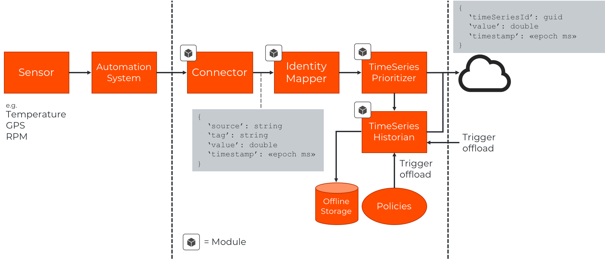

This section describes all the support for TimeSeries Modules. How they work,
how to build new ones and how to get them deployed.

TimeSeries modules are modules that take part in a [time series pipeline]().
It can represent the beginning of a pipeline, the thing that generated a [tag data point]()
or take part in the pipeline doing different tasks related to the data point.
It is however important to remember that it is primarily a data point oriented and optimized pipeline
and is not meant for hosting general purpose applications. In Dolittle terms, that is where
we have our core cloud [platform](/platform) and hosting experience and also our [edge](/edge) solutions.

## Who is this for

If you're working with time series data points and need a reliable way to capture this,
standardize the formats; the Dolittle TimeSeries Modules system provides you with what you
need to accomplish this.

The Dolittle TimeSeries Module provide a consistent development experience in how we see software development, with
high focus on our [core principles](/contributing/guidelines/core_principles/) and [development principles](/contributing/guidelines/development_principles/).

In addition to this, there is a high focus on bringing this capability not only to a cloud only
or an on-premise only environment, but bridge it by formalizing the edge and enabling you to
have multiple edge locations connected and streaming data points fro time series directly to
the cloud or leveraging our offline capability in conjunction with time series prioritization
and store time series offline and then offload it to the cloud or your own data center
whenever connectivity is restored or by other policies.

### Time series data pipeline

The module system is highly flexible and enables you build your own data pipeline.

An example of a data pipeline with the different formats coming out:

### Standard data point shapes

When working with vast amounts of sensor data and multiple different locations and
potentially multiple different automation system, standardization of the formats become
essential to be able to look at the data consistently.

Part of this standardization is to be consistently identifying the source of the system
and make it ubiquitous throughout. Dolittle provides a module that helps deal with
this and is called the [Identity Mapper](/timeseries/identitymapper/).

{}
The shape of the formats are work in progress and we're working on creating abstractions
for signal quality and other warning and error information. In addition to this we're
working on providing a consistent way to provide the raw signals on a specific channel
as well.
{}

## Microsoft IoT Edge

The abstractions provided by the underlying Dolittle TimeSeries modules system, we can
target any runtime environment. Right now, the only environment supported is the
[Microsoft IoT Edge modules](https://docs.microsoft.com/en-us/azure/iot-edge/iot-edge-modules).

We're hard at work making our own environment to provide a way to work independent if
you don't have an environment, but also provide support for other runtime environments.
