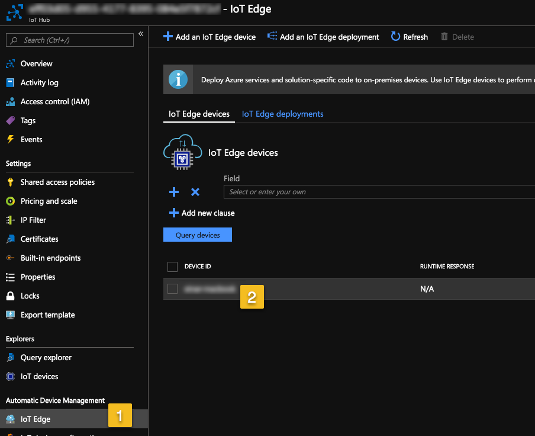
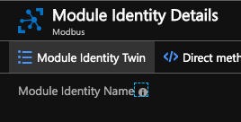

## Introduction

This tutorial is for C# and .NET only, as that is the only environment supported right now.
It builds on top of Azure IoT Hub and the IoT Edge offering from Microsoft.

## Pre-requisites

.NET 2.2 or better - download [here](https://dotnet.microsoft.com/download)

Azure Subscription - read more [here](https://azure.microsoft.com/en-us/)

Azure IoT Hub - read more [here](https://github.com/Azure/azure-iot-device-ecosystem/blob/master/setup_iothub.md)

Microsoft IoT Edge development environment - read more [here](https://github.com/Azure/iotedgedev/wiki/manual-dev-machine-setup)

## Setting up project

Lets start by creating a folder for your project, call it "MyFirstConnectorModule".
Inside this folder we then want to create a new .NET Core project, from the CLI you can do the following:

```shell
$ dotnet new console
```

Once created, we need to change the generated `.csproj`. Add the project capability for IoT Edge:

```xml
<ItemGroup>
    <ProjectCapability Include="AzureIoTEdgeModule" />
</ItemGroup>
```

Then we're going to need to add NuGet package references to [Dolittle.TimeSeries.Modules](https://www.nuget.org/packages/Dolittle.TimeSeries.Modules/)
and [Dolittle.TimeSeries.Modules.IoTEdge](https://www.nuget.org/packages/Dolittle.TimeSeries.Modules.IoTEdge/).
You can do this using the `dotnet` CLI tool or your IDEs package manager, or editing the `.csproj` file
directly and add the following:

```xml
<ItemGroup>
    <PackageReference Include="Dolittle.TimeSeries.Modules" Version="5.*" />
    <PackageReference Include="Dolittle.TimeSeries.Modules.IoTEdge" Version="5.*" />
</ItemGroup>
```

## Booting

Part of building a module is that it needs to boot the core Dolittle fundamentals and
get the module environment set up. Open the `Program.cs` file and add the correct
using statement and start the bootloader:

```c#
using Dolittle.TimeSeries.Modules.Booting;

namespace MyFirstConnectorModule
{
    class Program
    {
        static void Main()
        {
            Bootloader.Configure(_ => {}).Start().Wait();
        }
    }
}
```

This is enough to get going and be ready to create a connector or message handlers.

If you want to run this locally without packaging it up as a Docker container first and enable debugging,
please follow the instructions [here](https://docs.microsoft.com/en-us/azure/iot-edge/how-to-vs-code-develop-module#debug-a-module-without-a-container-c-nodejs-java).

{}
Due to the certificate usage of Microsoft IoT Edge, you might run into issues running it barebone without a
container. These are known issues and you might just be better off going for the container.
{}

## Connector

Let's add a simple connector that will be discovered and hooked up automatically. We're not going to do anything
in it, but its the place you'd typically go and add your logic for connecting to a source and get the data from.
We're going to do a pull based connector, read more about connectors [here]().

Add a class called `Connector` to your project and put the following code into it:

```c#
using System;
using Dolittle.TimeSeries.Modules;
using Dolittle.TimeSeries.Modules.Connectors;

namespace MyFirstConnectorModule
{
    public class Connector : IAmAPullConnector
    {
        public Source Name => "MyConnector";

        public IEnumerable<TagWithData> GetAllData()
        {
            Console.WriteLine("Getting all the data");

            return new TagWithData[0];
        }

        public object GetData(Tag tag)
        {
            return 0;
        }
    }
}
```

## Docker

Running modules in a production environment requires packaging your module as a Docker container image.
Below is a Dockerfile that also supports debugging when running things locally.
Add a file called `Dockerfile` to your project and copy/paste the following into it:

```dockerfile
FROM microsoft/dotnet:2.1-runtime-stretch-slim as base

ARG CONFIGURATION=Release

RUN echo Configuration = $CONFIGURATION

RUN if [ "$CONFIGURATION" = "Debug" ] ; then apt-get update && \
    apt-get install -y --no-install-recommends unzip procps && \
    rm -rf /var/lib/apt/lists/* \
    ; fi

RUN useradd -ms /bin/bash moduleuser
USER moduleuser


RUN if [ "$CONFIGURATION" = "debug" ] ; then curl -sSL https://aka.ms/getvsdbgsh | bash /dev/stdin -v latest -l ~/vsdbg ; fi

FROM microsoft/dotnet:2.1-sdk AS build-env
WORKDIR /app

ARG CONFIGURATION

COPY *.csproj ./Source/

WORKDIR /app/Source/

RUN dotnet restore

COPY . ./
RUN dotnet publish -c $CONFIGURATION -o out

FROM base

WORKDIR /app
COPY --from=build-env /app/Source/out ./

ENTRYPOINT ["dotnet", "[Assembly to run].dll"]
```

To build the container image, you simply do:

```shell
$ docker build -t myfirstconnectormodule .
```

If you want to enable debugging, you run it with a build arg saying to build the debug configuration:

```shell
$ docker build -t myfirstconnectormodule . --build-arg CONFIGURATION="Debug"
```

## Configuring IoT Edge Developer tool

Your developer machine needs to added as a device in the IoT Edge section of IoT Hub.
Follow the instructions [here](https://docs.microsoft.com/en-us/azure/iot-edge/how-to-register-device-portal)
and keep the connectionstring handy.

We now need to configure the IoT Edge developer tool.
Use the connectionstring from before and follow the instructions found [here](https://github.com/Azure/iotedgehubdev#quickstart).

## Running

Running this in a development environment, requires us to configure a deployment that we can use with
the IoT Edge tooling.

Add a file called `deployment.json` in your project and add the following content to it:

```json
{
    "modulesContent": {
        "$edgeAgent": {
            "properties.desired": {
                "schemaVersion": "1.0",
                "runtime": {
                    "type": "docker",
                    "settings": {
                        "minDockerVersion": "v1.25",
                        "loggingOptions": "",
                        "registryCredentials": {}
                    }
                },
                "systemModules": {
                    "edgeAgent": {
                        "type": "docker",
                        "env": {
                            "RuntimeLogLevel": "debug"
                        },
                        "settings": {
                            "image": "mcr.microsoft.com/azureiotedge-agent:1.0",
                            "createOptions": "{}"
                        }
                    },
                    "edgeHub": {
                        "type": "docker",
                        "status": "running",
                        "restartPolicy": "always",
                        "settings": {
                            "image": "mcr.microsoft.com/azureiotedge-hub:1.0",
                            "createOptions": "{\"HostConfig\":{\"PortBindings\":{\"5671/tcp\":[{\"HostPort\":\"5671\"}],\"8883/tcp\":[{\"HostPort\":\"8883\"}],\"443/tcp\":[{\"HostPort\":\"443\"}]}}}"
                        }
                    }
                },
                "modules": {
                    "MyConnector": {
                        "version": "1.0",
                        "type": "docker",
                        "status": "running",
                        "restartPolicy": "always",
                        "settings": {
                            "image": "myfirstconnectormodule",
                            "createOptions": "{\"HostConfig\":{}}"
                        }
                    }
                }
            }
        },
        "$edgeHub": {
            "properties.desired": {
                "schemaVersion": "1.0",
                "routes": {
                    "MyConnectorToCloud": "FROM /messages/modules/MyConnector/* INTO $upstream"
                },
                "storeAndForwardConfiguration": {
                    "timeToLiveSecs": 7200
                }
            }
        }
    }
}
```

Notice that the connector is called `MyConnector` points to the `myfirstconnectormodule` image.
You can read more about the deployment manifest and how to manage routing [here](https://docs.microsoft.com/en-us/azure/iot-edge/module-composition).

Once this is configured, we can run the deployment using the `iotedgehubdev` CLI tool:

```shell
$ iotedgehubdev start -d deployment.json -v
```

## Configuring Module

In order for the module to start working properly, we will need to set the configuration of the module from IoT Hub.
Go into the Azure Portal and navigate to your developer machine:



Find your module in the list and select it.

We will now configure the **module identity twin** by clicking the button on the top



In the JSON document being displayed, find the top level property called `properties` and
its object called `desired` within it. Let's put the `pullConnectors` configuration into this:

```json
{
    "properties": {
        "desired": {
            "pullConnectors": {
                "MyConnector": {
                    "interval": 1000
                }
            }
        }
    }
}
```

Save the configuration using the `Save` button at the top.
The interval is now set to 1000 milliseconds and will start calling your `GetAllData()` method once a second.

## Debugging
